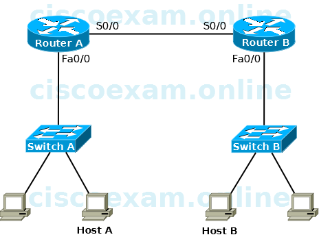

옥텟

> 1 octet = 8 bit = 1 Byte

### Media Access Control

**맥 주소**

이더넷 장비[랜카드]는 6옥텟의 주소를 가진다

    1. OUI              [ 3 Byte ]   = 제조사
    2. Host Identifier  [ 3 Byte ]   = 시리얼 넘버

    예시 : 74-56-3C-46-42-47

TCP / IP 통신을 하더라도 ARP[Address Resolution Protocol]를 통해 MAC 주소로 변환하여 통신한다

다음 그림에서 Host A 가 Host B로 요청하기 위해 다음 2가지 정보를 함께 보낸다

    1. 동일 네트워크에 존재하는 Router A의 MAC 주소
    2. Host B의 IP주소

### 통신 방식

**유니 캐스트**

> 1:1 통신

네트워크에 속한 모든 단말에 전송 -> 랜카드의 맥주소와 도착지 MAC주소가 동일 할 시 수신
