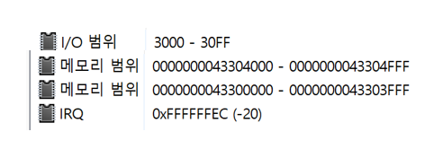

### 랜카드

Network Interface Card

    데이터를 스위치/허브/라우터 에 전달 또는 받은 데이터를 CPU로 전달

환경에 따른 구분

    이더넷 / 토큰링 / FDDI / ATM

    이더넷은 데스크톱 / 노트북 / 프린터 / 외부

PC의 버스 방식과 같은 랜카드를 선택해야한다.

    PCI / ISA / EISA

랜카드의 리소스

    IRQ : 이 값을 이용해서 CPU에 인터럽트를 건다
    메모리 범위 : CPU는 인터럽트를 받으면 해당 메모리 위치로 이동하여 데이터를 처리한다.

---

### 허브

멀티포트 리피터

    포트가 많고, 들어온 데이터를 재전송 한다

    -> 하나의 포트로 들어온 데이터는 모든 포트에 전달된다.

들어온 프레임의 목적지 맥 주소가 랜카드의 맥주소와 일치한다면 데이터를 받는다 아니면 버린다.

허브에 연결된 단말은 CSMA/CD 방식으로 통신한다. 즉 허브에 연결된 PC들은 Collision Domain에 속한다. -> 네트워크 대역폭(속도)이 아무리 넓어도 동시에 하나의 통신만 처리할 수 있다.

**종류**

Intelligent 허브

    Auto Partition 기능

        포트에 연결된 단말에 문제 발생-> 네트워크에서 분리 하고 허브에 표시

    NMS를 통해서 관리

Dummy 허브

    보통의 허브를 의미

**한계점**

Collision Domain에 의해 한 순간에는 한 PC만 데이터를 전송 할 수 있다.

---

### 스위치

포트별로 Collision Domain이 나눠진다.

### 브리지
